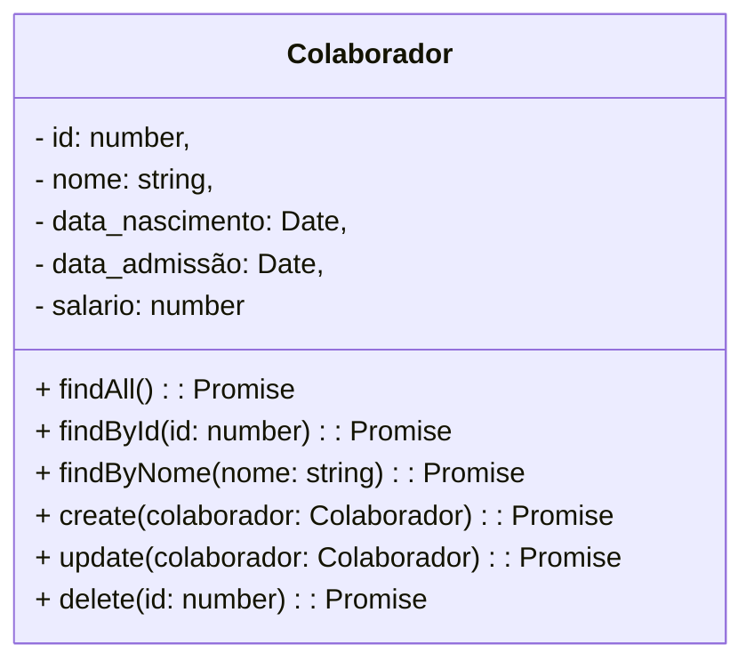

# GroupTwo RH - Backend

<br />

<div align="center">
    
</div>


<br /><br />

## 1. Descrição

Este projeto consiste no desenvolvimento de uma aplicação para a gestão de colaboradores de um departamento de RH, utilizando tecnologias modernas e robustas. Ele permite o cadastro, consulta, atualização e exclusão de informações sobre os colaboradores, facilitando a organização e acessibilidade dos dados.

------

## 2. Sobre esta API

A API de Gerenciamento de Colaboradores permite que os sistemas de RH cadastrem, consultem, atualizem e excluam colaboradores.

### 2.1. Principais Funcionalidades

1. Cadastro de Colaboradores: Inserção de dados essenciais sobre o colaborador através do método HTTP: POST.
2. Consulta: Visualização dos colaboradores cadastrados por meio de endpoints específicos com HTTP: GET para consultas por id, nome ou a visualização geral de todos os contratados.
3. Atualização: Modificação de registros existentes no cadatro do colaborador por meio do HTTP: PUT.
4. Exclusão: Remoção de colaboradores do banco de dados através do ID pelo método HTTP: DELETE.

------

## 3. Diagrama de Classes



------

## 4. Diagrama Entidade-Relacionamento (DER)

<div align="center">
    
</div>


------

## 5. Tecnologias utilizadas

| Item                          | Descrição  |
| ----------------------------- | ---------- |
| **Servidor**                  | Node JS    |
| **Linguagem de programação**  | TypeScript |
| **Framework**                 | Nest JS    |
| **ORM**                       | TypeORM    |
| **Banco de dados Relacional** | MySQL      |

------

## 6. Configuração e Execução

### 6.1. Entenda as três ferramentas

Este projeto usa **Nix + devenv + direnv**:

| Ferramenta | Responsabilidade |
| ---------- | ---------------- |
| Nix | Obtém os pacotes e suas dependências em `/nix/store`, sem substituir o Node ou MySQL do sistema. |
| devenv | Declara quais ferramentas, variáveis, serviços e comandos o projeto precisa. |
| direnv | Carrega e descarrega o ambiente do terminal ao entrar e sair da pasta. |

O fluxo é: entrar na pasta → direnv lê `.envrc` → devenv avalia a configuração → Nix fornece os pacotes → o terminal recebe o `PATH` e as variáveis do projeto.

Isso **não é um container**: os processos usam seu usuário, sistema de arquivos e rede. Os dados do MySQL ficam separados por projeto, mas as portas ainda pertencem à máquina. Não é necessário instalar MySQL globalmente nem usar Docker.

O ambiente fornece Node 22, npm e MySQL 8.4. As versões exatas dos pacotes são determinadas pelo `devenv.lock`; o `package-lock.json` continua determinando as dependências JavaScript. São duas camadas diferentes de reprodutibilidade.

### 6.2. Preparar uma máquina — uma vez por máquina

Se `nix --version`, `devenv --version` e `direnv version` já funcionam, pule a instalação.

1. Instale Nix seguindo o [guia oficial](https://devenv.sh/getting-started/). Linux e macOS são suportados; no Windows, utilize uma distribuição Linux no WSL2 e mantenha ferramentas e projeto nesse ambiente. A instalação de Nix modifica a máquina: revise o instalador antes de executá-lo.
2. Abra um novo terminal depois da instalação.
3. Instale devenv e direnv:

   ```sh
   nix --extra-experimental-features 'nix-command flakes' profile install nixpkgs#devenv nixpkgs#direnv
   ```

   A opção habilita as funcionalidades necessárias somente nessa execução. Em instalações que já as habilitam, basta `nix profile install nixpkgs#devenv nixpkgs#direnv`. Não duplique a instalação se você já gerencia essas ferramentas por NixOS, Home Manager ou outro mecanismo.

4. Configure o hook do direnv no arquivo de inicialização do **seu shell**, uma única vez:

   **Zsh:** ao final de `~/.zshrc`:

   ```sh
   eval "$(direnv hook zsh)"
   ```

   **Bash:** ao final de `~/.bashrc`:

   ```sh
   eval "$(direnv hook bash)"
   ```

   **Fish:** em `~/.config/fish/config.fish`:

   ```fish
   direnv hook fish | source
   ```

5. Abra outro terminal para carregar o hook.

Coloque o hook depois de inicializadores que alteram o `PATH`, como mise, nvm ou asdf. Não é necessário removê-los: confira qual executável está ativo com `command -v node`. Na pasta do projeto, esperamos um caminho em `/nix/store`.

A integração deste repositório usa `devenv direnvrc`, disponível desde devenv 1.4. A configuração foi validada com devenv 2.1.2; para novos ambientes, prefira uma versão estável atual e confira as notas de atualização. O lockfile dos módulos não fixa a versão do executável devenv instalado na máquina.

### 6.3. Preparar este projeto — uma vez por clone

Na raiz do repositório:

```sh
direnv allow
node --version
npm --version
command -v node
setup
```

`direnv allow` autoriza a execução do `.envrc` **depois de você revisar seu conteúdo**. Ele não instala o hook do shell. Cada pessoa precisa autorizar seu próprio clone; alterações no `.envrc` exigem nova autorização.

`setup` é um comando declarado no `devenv.nix`: entra na raiz do projeto e executa `npm ci`. O npm usa o lockfile existente, falha se ele estiver incompatível com o manifesto e recria `node_modules`. Execute novamente depois de alterações no lockfile ou no runtime; não use `npm ci` enquanto outro processo depende da instalação em andamento.

A primeira ativação pode demorar para baixar os pacotes. Entradas posteriores usam os caches. **Entrar na pasta não instala dependências JavaScript e não inicia serviços automaticamente.**

Sem o hook do direnv, é possível executar os mesmos passos explicitamente:

```sh
devenv shell
setup
```

Ou executar apenas um comando no ambiente, sem abrir um terminal interativo:

```sh
devenv shell -- setup
devenv shell -- npm run build
```

### 6.4. Iniciar e validar a aplicação

Depois de instalar as dependências:

```sh
devenv up
```

Mantenha esse terminal aberto. O devenv:

1. Inicia o MySQL local, restrito a `127.0.0.1`.
2. Inicializa seus dados na primeira execução.
3. Cria `db_rhcolaboradores` e o usuário local `rh`.
4. Espera a configuração do banco concluir.
5. Executa `npm run start:dev`.

Em outro terminal, na mesma pasta e com o ambiente carregado:

```sh
curl --fail http://localhost:4000/colaboradores
rh-db -e 'SELECT VERSION(), DATABASE();'
npm run build
```

Em um banco novo, a listagem de colaboradores retorna `[]`. `rh-db` é um atalho para o cliente MySQL com host, porta, usuário e banco do ambiente.

Para iniciar somente o MySQL e garantir a criação do banco e do usuário:

    devenv up mysql

Em outro terminal, configure o banco e execute a API manualmente:

    devenv tasks run devenv:mysql:configure
    npm run start:dev

Para encerrar a execução em primeiro plano, use `Ctrl+C`. Se você optar por `devenv up -d` para iniciar serviços em segundo plano, encerre-os explicitamente com `devenv processes down`.

**Sair da pasta descarrega o ambiente do terminal, mas não encerra processos já iniciados.** Encerrar os processos também não apaga os dados do banco.

### 6.5. O que cada arquivo faz

| Arquivo | Conteúdo | Versionar? |
| ------- | -------- | ---------- |
| [`devenv.nix`](./devenv.nix) | Ferramentas, variáveis, MySQL, processos e scripts. | Sim |
| [`devenv.yaml`](./devenv.yaml) | Fontes dos pacotes e módulos, chamadas inputs. | Sim |
| [`devenv.lock`](./devenv.lock) | Revisões e hashes das fontes usadas para construir o ambiente. | Sim |
| [`.envrc`](./.envrc) | Integração entre direnv e devenv. | Sim |
| [`.gitignore`](./.gitignore) | Exclui caches, estado local e configurações pessoais. | Sim |
| [`package-lock.json`](./package-lock.json) | Árvore das dependências npm. | Sim |
| `.devenv/` | Estado local, incluindo os dados do MySQL. | Não |
| `.direnv/` | Cache local da integração, quando utilizado. | Não |
| `devenv.local.nix` / `devenv.local.yaml` | Ajustes pessoais não compartilhados. | Não |

Não ignore `devenv.lock`: sem ele, duas máquinas podem resolver versões diferentes a partir do mesmo input `rolling`. Não faça commit de segredos, dados do banco ou `node_modules`.

O arquivo `devenv.yaml` aponta para um catálogo de pacotes:

```yaml
inputs:
  nixpkgs:
    url: github:cachix/devenv-nixpkgs/rolling
```

`rolling` indica a fonte a consultar **quando você atualizar**; o lockfile existente conserva as revisões selecionadas.

A integração `.envrc` é:

```sh
#!/usr/bin/env bash

eval "$(devenv direnvrc)"
use devenv
```

O primeiro comando carrega as funções de integração fornecidas pelo devenv instalado. `use devenv` pede ao direnv para importar o ambiente. O direnv interpreta `.envrc` com Bash, mesmo quando seu terminal usa Zsh ou Fish. Não é necessário instalar nix-direnv separadamente para esta integração.

### 6.6. Como ler e modificar o `devenv.nix`

O arquivo é uma configuração Nix, não um script Bash:

```nix
{ pkgs, config, ... }:

{
  packages = [ pkgs.git ];

  languages.javascript = {
    enable = true;
    package = pkgs.nodejs_22;
    npm.enable = true;
    npm.install.enable = false;
  };
}
```

- `{ pkgs, config, ... }:` recebe os argumentos fornecidos pelo devenv. `pkgs` é o catálogo Nixpkgs; `config` permite consultar outras opções do ambiente.
- O segundo `{ ... }` contém as opções que queremos configurar.
- `packages` é uma lista de ferramentas adicionais.
- `languages.javascript.enable` ativa a integração JavaScript.
- `pkgs.nodejs_22` seleciona a família Node 22. O lockfile fixa a revisão do catálogo e, consequentemente, o patch disponível nela. Escolhemos Node 22 como LTS ainda suportado, sem migrar desnecessariamente para a versão mais recente.
- `npm.enable` disponibiliza npm; `npm.install.enable = false` mantém a instalação explícita.
- `;` encerra uma atribuição. Strings usam `"..."`, listas usam `[ ... ]` e strings multilinha usam `'' ... ''`.

Além desses blocos:

- `env` exporta valores para o shell e seus processos filhos.
- `services.mysql` fornece o servidor, o cliente e a inicialização do banco. Especificamos `pkgs.mysql84`, pois o pacote padrão desse módulo é MariaDB.
- A porta inicial do banco é `3307`, para evitar o MySQL usual da máquina em `3306`. O devenv pode alocar outra porta se necessário; `DB_PORT` lê `config.processes.mysql.ports.main.value`, mantendo cliente e servidor alinhados. Confira com `echo "$DB_PORT"`.
- `mysqlx = 0` desativa a interface MySQL X, que esta API não usa, evitando um segundo listener desnecessário.
- `initialDatabases` cria o banco; `ensureUsers` cria o usuário e concede permissões somente sobre esse banco.
- `scripts.setup.exec` e `scripts.rh-db.exec` geram executáveis disponíveis dentro do ambiente.
- `processes.api.exec` usa o comando já existente no projeto. `after = [ "devenv:mysql:configure" ]` impede a API de começar antes da criação do banco e do usuário.
- `enterShell` mostra instruções; não deve conter inicializações demoradas ou destrutivas.
- `enterTest` verifica a família Node, compila a API e consulta `/colaboradores`, exigindo uma resposta JSON em formato de lista. Isso verifica também a comunicação com o banco, mas não substitui uma suíte completa de testes funcionais.

`devenv test` inicia e encerra os processos configurados para executar essa verificação. Execute `setup` antes e encerre uma instância de `devenv up` que já esteja rodando, para evitar conflito na porta da API. Na versão 2.1.2 validada aqui, o banco de teste usa estado separado em `.devenv/test-state/mysql`, enquanto o desenvolvimento usa `.devenv/state/mysql`. A verificação HTTP faz somente uma consulta, sem criar colaboradores.

### 6.7. Variáveis de ambiente e dados

O [`AppModule`](./src/app.module.ts) agora lê:

| Variável | No devenv | Padrão sem devenv |
| -------- | --------- | ---------------- |
| `DB_HOST` | `127.0.0.1` | `localhost` |
| `DB_PORT` | Porta alocada, inicialmente `3307` | `3306` |
| `DB_USER` | `rh` | `root` |
| `DB_PASSWORD` | `rh-local` | `root` |
| `DB_NAME` | `db_rhcolaboradores` | `db_rhcolaboradores` |
| `PORT` | `4000` | `4000` |

Os valores antigos continuam sendo usados quando as variáveis de conexão não estão definidas, preservando o fluxo sem devenv. A aplicação converte `DB_PORT` em número, como o TypeORM espera.

**`rh-local` é uma credencial pública e descartável de desenvolvimento, não um segredo de produção.** O servidor local mantém administração por socket sem senha; não o exponha na rede nem utilize esta configuração em produção.

Não coloque senhas reais em `env` no Nix: valores podem acabar em arquivos legíveis no Nix store. Para segredos, utilize um mecanismo próprio de gestão de segredos ou injete variáveis em tempo de execução.

Um `.env` não é lido automaticamente pelo Node nem por esta configuração. Se outro projeto precisar dele, escolha conscientemente uma integração dotenv da aplicação ou do ambiente e defina sua precedência; mantenha segredos fora do Git. O `.envrc`, por outro lado, é código de shell e pode executar comandos.

O `synchronize: true` do TypeORM foi preservado: ele cria/ajusta tabelas no banco de desenvolvimento. Não use sincronização automática de esquema como estratégia de migração de produção.

Os dados ficam em `.devenv/state/mysql`. Não remova esse diretório como se fosse somente cache. Alterar `initialDatabases` ou `ensureUsers` não é uma migração: não remove bancos/usuários antigos, nem necessariamente altera senhas já existentes. Planeje alterações e faça backup antes de trocar a versão principal do MySQL.

### 6.8. Aplicar o mesmo método em qualquer projeto

O que muda entre linguagens são as ferramentas e comandos, não o mecanismo:

1. **Inventarie o projeto:** runtime/SDK, versão, gerenciador de dependências, lockfiles, comando de execução, build, testes, bibliotecas nativas e serviços externos.
2. **Inicialize na raiz:** execute `devenv init` se o projeto ainda não tiver uma configuração. Não sobrescreva uma configuração existente sem revisá-la.
3. **Declare o runtime/SDK:** use `languages.<linguagem>` e escolha um pacote compatível com o projeto.
4. **Acrescente ferramentas:** utilize `packages` para Git, compiladores e utilitários necessários.
5. **Declare serviços:** banco, Redis etc., somente quando forem necessários. Separe dados e restrinja serviços de desenvolvimento ao localhost.
6. **Defina variáveis e processos:** a aplicação deve ler as mesmas variáveis exportadas pelo ambiente. Apenas definir `DB_HOST` no devenv não reconfigura automaticamente uma aplicação que tem conexão fixa.
7. **Crie `.envrc`:** reutilize o conteúdo mostrado acima.
8. **Revise e autorize:** execute `direnv allow`.
9. **Restaure dependências:** use o gerenciador da linguagem e o mecanismo de lock apropriado.
10. **Verifique:** versão e caminho do runtime, build, testes, serviços e uma operação real da aplicação.
11. **Compartilhe:** versione configurações e lockfiles; exclua estado local e segredos.

Para encontrar pacotes e opções:

```sh
devenv search nodejs
devenv search dotnet
devenv search jdk
devenv search php
devenv info
```

Consulte também a [referência de opções](https://devenv.sh/reference/options/). Não adivinhe nomes de pacotes ou opções: eles dependem das revisões fixadas pelo projeto.

#### Exemplo: .NET

Em um projeto .NET, substitua o bloco JavaScript pelo SDK exigido pelo projeto. Por exemplo:

```nix
{ pkgs, ... }:

{
  languages.dotnet = {
    enable = true;
    package = pkgs.dotnetCorePackages.sdk_10_0;
  };
}
```

Depois da ativação:

```sh
dotnet --info
dotnet restore
dotnet build --no-restore
dotnet test --no-restore
```

O pacote deve ser um **SDK**, não somente um runtime. Alinhe a versão com `global.json` e os frameworks dos arquivos `.csproj`. Para projetos com `packages.lock.json`, considere `dotnet restore --locked-mode`. Se houver várias aplicações na solução, o processo deve apontar para o projeto executável correto, por exemplo `dotnet watch --project ./src/MinhaApi/MinhaApi.csproj run`.

#### Exemplo: Java

Para um projeto com Java 21 e Maven:

```nix
{ pkgs, ... }:

{
  languages.java = {
    enable = true;
    jdk.package = pkgs.jdk21;
    maven.enable = true;
  };
}
```

O módulo configura `JAVA_HOME` e usa o JDK escolhido no Maven. Confira:

```sh
java -version
mvn -version
mvn verify
```

Se o projeto possui Maven Wrapper, prefira `./mvnw verify`; ele conserva a versão do Maven definida pelo projeto. Para Gradle, utilize o wrapper `./gradlew` ou configure `languages.java.gradle.enable = true`, conforme a estratégia do repositório. A disponibilidade de um JDK não fixa automaticamente todas as dependências Maven/Gradle.

#### Exemplo: PHP

Para um projeto PHP 8.4 com Composer:

```nix
{ pkgs, ... }:

{
  languages.php = {
    enable = true;
    package = pkgs.php84;
  };
}
```

O módulo disponibiliza Composer associado ao pacote PHP. Confira:

```sh
php --version
composer --version
composer install
composer check-platform-reqs
```

Versione `composer.lock` quando apropriado para o projeto. Confira extensões exigidas por `composer.json`, como `pdo_mysql`, `intl` e `mbstring`; a versão do PHP sozinha não garante que todas estejam disponíveis. Consulte as opções do módulo antes de personalizar extensões. O comando de execução depende do framework e da arquitetura: PHP CLI, servidor de desenvolvimento ou PHP-FPM.

Esses exemplos são pontos de partida, não migrações obrigatórias para .NET 10, Java 21 ou PHP 8.4. Escolha a versão exigida por cada projeto. Você pode combinar vários blocos de linguagem no mesmo ambiente, por exemplo Node para assets e PHP para a aplicação.

### 6.9. Atualizações e diagnóstico

| Situação | Ação |
| -------- | ---- |
| `.envrc is blocked` | Revise `.envrc` e execute `direnv allow`. |
| Não carrega ao entrar na pasta | Confira o hook do shell e abra outro terminal; use `direnv status`. |
| Node continua vindo do mise/nvm | Confira `command -v node`, a ordem dos hooks e `direnv reload`. |
| `nest: command not found` | Execute `setup` no ambiente para restaurar as dependências. |
| API não conecta ao banco | Confira logs de `devenv up`, `echo "$DB_PORT"` e `rh-db -e 'SELECT 1;'`. |
| Porta 4000 ocupada | Encerre somente o processo conhecido ou configure outra `PORT` e reinicie a aplicação. |
| Aviso de locale indisponível | Compare `locale -a` fora e dentro do ambiente; confira `LOCALE_ARCHIVE` e recarregue o direnv após alterações. Veja a explicação abaixo. |
| Downloads falham | Confira rede, certificados, proxy e limites de acesso às fontes/caches do Nix. |

Para atualizar os inputs de ambiente conscientemente:

```sh
devenv update
direnv reload
setup
devenv test
```

Revise o diff do `devenv.lock` e execute a aplicação antes de compartilhar a atualização. Reinicie os processos para que recebam novas ferramentas/configurações. Atualizar inputs pode alterar patches do Node, MySQL e módulos; não faça isso apenas para abrir o projeto.

Atualizar as dependências npm é uma operação separada, feita pelo npm e refletida em `package.json` / `package-lock.json`. Atualizar o executável devenv da máquina também é separado dos inputs do projeto.

#### Locales no Linux: preservar português brasileiro

Um locale define regras de codificação, ordenação, datas, números e mensagens.
`LANG` escolhe o locale padrão; variáveis `LC_*` escolhem categorias específicas.
Quando definida, `LC_ALL` tem precedência sobre todas elas.

No Arch Linux usado para validar este projeto, `pt_BR.UTF-8` já estava gerado
no sistema. Entretanto, os programas Nix utilizavam outro arquivo de locales,
que continha apenas `en_US` e os locales básicos. Por isso, os shells emitiam:

```text
warning: setlocale: LC_ALL: cannot change locale (pt_BR.UTF-8): No such file or directory
```

Gerar novamente o locale do sistema não corrigiria esse arquivo do Nix.
O projeto agora exporta, somente no Linux, um arquivo completo de locales
fornecido pelo mesmo Nixpkgs fixado no lockfile:

```nix
{ pkgs, config, lib, ... }:

{
  env = {
    # Outras variaveis do projeto.
  } // lib.optionalAttrs pkgs.stdenv.hostPlatform.isLinux {
    LOCALE_ARCHIVE = "${pkgs.glibcLocales}/lib/locale/locale-archive";
  };
}
```

Esse trecho ilustra a estrutura: em um projeto existente, acrescente a
atribuição ao bloco `env` existente, sem duplicar o bloco nem substituir
suas outras variáveis.

- `lib.optionalAttrs` adiciona as opções somente quando a condição é verdadeira.
- `//` combina os dois conjuntos de atributos.
- `pkgs.glibcLocales` fornece os dados de locales, incluindo `pt_BR.UTF-8`.
- `LOCALE_ARCHIVE` informa à glibc utilizada pelos programas Nix onde encontrá-los.
- A condição Linux evita aplicar uma configuração específica de glibc ao macOS.

Não fixamos `LANG` ou `LC_ALL` no projeto: preservamos a preferência regional
do usuário e fornecemos os dados necessários para atendê-la. Essa configuração
independe da linguagem da aplicação e pode ser reutilizada em projetos Node,
.NET, Java ou PHP no Linux.

Depois de alterar a configuração:

```sh
direnv reload
echo "$LOCALE_ARCHIVE"
locale -a
locale charmap
bash -c 'locale charmap'
rh-db --version
```

Neste projeto, o arquivo deve estar em `/nix/store`, a lista deve incluir
`pt_BR.utf8` e os comandos `locale charmap` devem retornar `UTF-8` sem avisos.
`rh-db --version` verifica os wrappers de shell sem precisar de um servidor
MySQL ativo. Não é necessário executar `setup` nem `devenv update` para aplicar
essa correção.

Reinicie processos e shells abertos antes da mudança: eles podem continuar
com o valor antigo de `LOCALE_ARCHIVE`. Se você usa `devenv shell`, saia dele
e entre novamente; no fluxo com direnv, recarregue o ambiente no terminal.
Não exporte globalmente um caminho copiado de `/nix/store`: deixe cada projeto
obter o pacote correto a partir do seu próprio lockfile.

Na versão 2.1.2 instalada, executar `devenv shell` diretamente de um terminal
sem o ambiente carregado ainda pode emitir um aviso durante a inicialização,
antes de aplicar as variáveis do projeto. Os comandos dentro do ambiente
corrigido não emitem esse aviso. No fluxo deste projeto, carregue primeiro
o ambiente com direnv; em um terminal não interativo, a alternativa validada é:

```sh
direnv exec . devenv shell
```

Para diagnosticar o mesmo aviso em outro projeto, compare `locale -a` fora e
dentro do ambiente. Se o locale também estiver ausente no sistema, configure-o
conforme a distribuição. Se estiver ausente somente no Nix, corrija o arquivo
de locales do ambiente. Não oculte o stderr nem force outro locale apenas para
silenciar o aviso: isso pode alterar regras regionais utilizadas pela aplicação.

### 6.10. Executar sem devenv

O fluxo tradicional continua disponível:

1. Instale uma versão compatível do Node e um MySQL externo.
2. Execute `npm ci`.
3. Configure `DB_HOST`, `DB_PORT`, `DB_USER`, `DB_PASSWORD` e `DB_NAME` no ambiente do processo, ou use os padrões antigos da tabela acima.
4. Crie o banco no MySQL externo.
5. Execute `npm run start:dev`.

Para não carregar o ambiente automaticamente nesse clone, execute `direnv deny` e abra um novo terminal. O diretório pode continuar configurado para outras pessoas.

### 6.11. Referências

- [Instalação e comandos do devenv](https://devenv.sh/getting-started/)
- [Integração devenv + direnv](https://devenv.sh/integrations/direnv/)
- [Hooks do direnv por shell](https://direnv.net/docs/hook.html)
- [Pacotes](https://devenv.sh/packages/)
- [Processos e dependências de inicialização](https://devenv.sh/processes/)
- [Opções disponíveis](https://devenv.sh/reference/options/)

Desde devenv 2.0 existe ativação automática nativa por `devenv hook`. Ela é uma alternativa ao direnv, não uma exigência adicional. Este projeto usa direnv deliberadamente; não configure os dois mecanismos de ativação simultaneamente.
